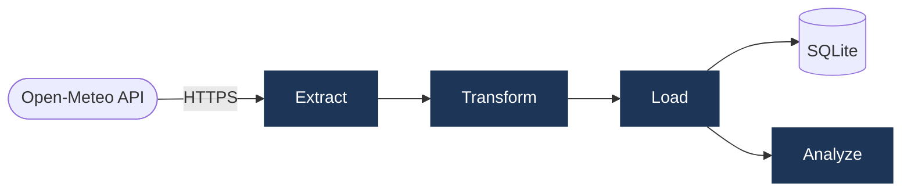

# Weather ETL Pipeline

Pulls 90 days of weather data for Lahore from the [Open-Meteo API](https://open-meteo.com), runs statistical transforms and anomaly detection, and stores the result in SQLite. No API key needed.

## Architecture



| Stage | What it does |
|---|---|
| Extract | Fetches raw daily records, validates schema, raises on missing fields |
| Transform | Computes temp averages, 7-day rolling stats, rain flags, anomaly detection, period trend |
| Load | Writes to `lahore_weather` table; appends a run record to `pipeline_runs` |
| Analyze | Logs a structured summary report and returns a metrics dict |

## Setup

```bash
git clone https://github.com/zohaibNaseem/etl-pipeline-python.git
cd etl-pipeline-python

python -m venv .venv
source .venv/bin/activate      # Windows: .venv\Scripts\activate

pip install -r requirements.txt
python pipeline.py
```

## Project structure

```
├── pipeline.py          # single entrypoint — runs the full ETL
├── requirements.txt
├── .gitignore
├── pipeline.log         # appended on every run (git-ignored)
└── weather_pipeline.db  # SQLite output (git-ignored)
```

## Database

**`lahore_weather`** — one row per day

| Column | Description |
|---|---|
| date | ISO 8601 date |
| temp_max / temp_min | Daily high and low (°C) |
| temp_avg / temp_range | Computed mean and diurnal range |
| rolling_7d_avg_temp | 7-day rolling temperature average |
| rolling_7d_precip | 7-day rolling precipitation total (mm) |
| is_rainy | True when precipitation > 0 |
| temp_anomaly | True when temp deviates > 2 std from rolling mean |
| period_trend | `warming` / `cooling` / `stable` for the full period |
| pipeline_run_ts | UTC timestamp of the pipeline run |

**`pipeline_runs`** — one row per execution (timestamp, record count, status, error message)

