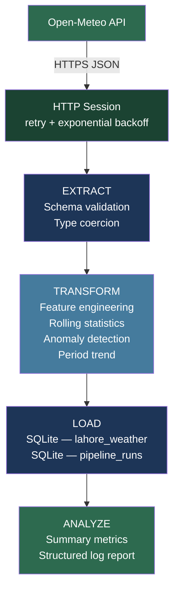

# Weather ETL Pipeline

A production-grade Extract-Transform-Load pipeline that collects 90 days of historical weather data for Lahore, Pakistan from the [Open-Meteo API](https://open-meteo.com), enriches it with statistical features, persists it to SQLite, and produces a structured analytics report.

No API key required. Runs as a single Python script.

---

## Architecture

```
+------------------+        HTTPS / JSON        +---------------------+
|                  | -------------------------> |                     |
|  Open-Meteo API  |                            |  HTTP Session       |
|  (open-meteo.com)|                            |  (retry + backoff)  |
|                  | <------------------------- |                     |
+------------------+   temperature, precip data +---------------------+
                                                          |
                                                          | raw DataFrame
                                                          v
                                              +-----------+----------+
                                              |                      |
                                              |   STAGE 1: EXTRACT   |
                                              |                      |
                                              |  - Schema validation |
                                              |  - Empty-set check   |
                                              |  - Type coercion     |
                                              +-----------+----------+
                                                          |
                                                          | validated DataFrame
                                                          v
                                              +-----------+----------+
                                              |                      |
                                              |  STAGE 2: TRANSFORM  |
                                              |                      |
                                              |  - Null row removal  |
                                              |  - Feature eng.      |
                                              |    temp_avg          |
                                              |    temp_range        |
                                              |    rolling_7d_avg    |
                                              |    rolling_7d_precip |
                                              |    is_rainy flag     |
                                              |  - Anomaly detection |
                                              |    (z-score / std)   |
                                              |  - Period trend      |
                                              |    warming/cooling/  |
                                              |    stable label      |
                                              |  - Pipeline metadata |
                                              +-----------+----------+
                                                          |
                                                          | enriched DataFrame
                                                          v
                                              +-----------+----------+
                                              |                      |
                                              |   STAGE 3: LOAD      |
                                              |                      |
                                              |  SQLite              |
                                              |  +-----------------+ |
                                              |  | lahore_weather  | |
                                              |  +-----------------+ |
                                              |  | pipeline_runs   | |
                                              |  +-----------------+ |
                                              |                      |
                                              +-----------+----------+
                                                          |
                                                          | persisted data
                                                          v
                                              +-----------+----------+
                                              |                      |
                                              |   STAGE 4: ANALYZE   |
                                              |                      |
                                              |  - Period summary    |
                                              |  - Hottest / coldest |
                                              |  - Rainy day %       |
                                              |  - Precipitation     |
                                              |  - 7-day rolling avg |
                                              |  - Anomaly count     |
                                              |  - Trend label       |
                                              |                      |
                                              |  Output: structured  |
                                              |  log + metrics dict  |
                                              +----------------------+
```

### Mermaid diagram (rendered on GitHub)



---

## Features

| Feature | Details |
|---|---|
| Data source | Open-Meteo API — no API key, no rate limits for reasonable use |
| Location | Lahore, Pakistan (31.5 N, 74.3 E) |
| Historical window | 90 days |
| Rolling statistics | 7-day rolling mean and standard deviation (temperature), 7-day rolling sum (precipitation) |
| Anomaly detection | Flags days where temperature deviates more than 2 standard deviations from the 7-day rolling mean |
| Trend analysis | Classifies the 90-day period as warming / cooling / stable by comparing first-half vs second-half mean temperature |
| Run tracking | Every pipeline execution is recorded in the `pipeline_runs` table (timestamp, record count, status) |
| Retry logic | Automatic retry with exponential backoff on HTTP 429 / 5xx responses |
| Structured logging | Timestamped log lines to stdout and `pipeline.log` |
| Error handling | Each stage catches and logs specific exceptions; failed runs are recorded and exit with code 1 |

---

## Project Structure

```
.
├── pipeline.py          # ETL pipeline — single entrypoint
├── requirements.txt     # Pinned Python dependencies
├── .gitignore           # Excludes *.db, logs, venvs, IDE files
├── README.md            # This file
├── pipeline.log         # Runtime log (auto-created, git-ignored)
└── weather_pipeline.db  # SQLite output (auto-created, git-ignored)
```

---

## Database Schema

### `lahore_weather`

| Column | Type | Description |
|---|---|---|
| date | TEXT | ISO 8601 date |
| temp_max | REAL | Daily maximum temperature (°C) |
| temp_min | REAL | Daily minimum temperature (°C) |
| precipitation | REAL | Daily precipitation sum (mm) |
| temp_avg | REAL | Computed daily mean temperature |
| temp_range | REAL | Diurnal temperature range |
| rolling_7d_avg_temp | REAL | 7-day rolling mean temperature |
| rolling_7d_std_temp | REAL | 7-day rolling standard deviation of temperature |
| rolling_7d_precip | REAL | 7-day rolling precipitation total |
| is_rainy | INTEGER | 1 if precipitation > 0, else 0 |
| temp_anomaly | INTEGER | 1 if temperature is a statistical outlier |
| period_trend | TEXT | warming / cooling / stable |
| pipeline_run_ts | TEXT | UTC timestamp of the pipeline run |

### `pipeline_runs`

| Column | Type | Description |
|---|---|---|
| run_ts | TEXT | UTC timestamp |
| records_loaded | INTEGER | Number of rows written |
| status | TEXT | success / failed |
| error_message | TEXT | Error detail if failed |

---

## Setup

```bash
# 1. Clone
git clone https://github.com/zohaibNaseem/etl-pipeline-python.git
cd etl-pipeline-python

# 2. Create virtual environment
python -m venv .venv
source .venv/bin/activate   # Windows: .venv\Scripts\activate

# 3. Install dependencies
pip install -r requirements.txt

# 4. Run
python pipeline.py
```

---

## Sample Output

```
2026-03-02 10:00:00 [INFO    ] weather_etl: Pipeline starting at 2026-03-02 10:00:00 UTC
2026-03-02 10:00:00 [INFO    ] weather_etl: EXTRACT — requesting data from Open-Meteo API
2026-03-02 10:00:01 [INFO    ] weather_etl: EXTRACT — received 91 records
2026-03-02 10:00:01 [INFO    ] weather_etl: TRANSFORM — processing 91 raw records
2026-03-02 10:00:01 [INFO    ] weather_etl: TRANSFORM — 85 records after enrichment
2026-03-02 10:00:01 [INFO    ] weather_etl: LOAD — writing 85 records to 'weather_pipeline.db'
2026-03-02 10:00:01 [INFO    ] weather_etl: LOAD — complete
2026-03-02 10:00:01 [INFO    ] weather_etl: -------------------------------------------------------
2026-03-02 10:00:01 [INFO    ] weather_etl: ANALYTICS REPORT — Lahore Weather (2025-11-XX to 2026-03-01)
2026-03-02 10:00:01 [INFO    ] weather_etl: -------------------------------------------------------
2026-03-02 10:00:01 [INFO    ] weather_etl: Total days analyzed        : 85
2026-03-02 10:00:01 [INFO    ] weather_etl: Average temperature        : 14.80 C
2026-03-02 10:00:01 [INFO    ] weather_etl: Hottest day                : 2025-11-XX (28.5 C)
2026-03-02 10:00:01 [INFO    ] weather_etl: Coldest day                : 2026-01-XX (4.2 C)
...
2026-03-02 10:00:01 [INFO    ] weather_etl: Pipeline completed in 1.23s — 85 records processed
```

---

## Configuration Reference

All constants are defined at the top of `pipeline.py`:

| Constant | Default | Purpose |
|---|---|---|
| `ROLLING_WINDOW` | 7 | Days for rolling statistics |
| `PRECIP_THRESHOLD` | 0.0 mm | Minimum precipitation to classify a day as rainy |
| `ANOMALY_STD_FACTOR` | 2.0 | Standard deviation multiplier for anomaly detection |
| `TREND_DELTA_C` | 0.5 | Minimum mean temperature shift (°C) to label a trend |
| `REQUEST_TIMEOUT` | 30 s | HTTP request timeout |
| `MAX_RETRIES` | 3 | Maximum retry attempts on API failure |
| `BACKOFF_FACTOR` | 1 s | Exponential backoff base for retries |

---

## License

MIT
