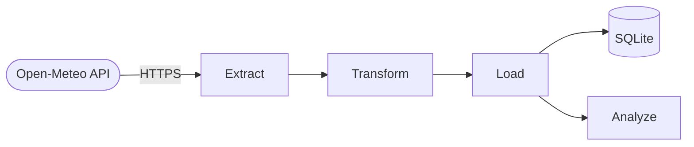

# Weather ETL Pipeline

This pipeline gets 90 days of daily weather data for Lahore from the
[Open-Meteo API](https://open-meteo.com). It calculates statistics, finds temperature anomalies and
stores the result in SQLite. The API needs no key.

## Architecture



| Stage | Function |
|---|---|
| Extract | Gets the daily records. Checks that all required fields are present. Stops with an error if a field is missing. |
| Transform | Calculates the average temperature, 7-day rolling values, rain flags, anomalies and the trend for the period. |
| Load | Writes the data to the `lahore_weather` table. Adds one record for the run to `pipeline_runs`. |
| Analyze | Writes a summary report to the log and returns the metrics as a dictionary. |

## Reliability
* The HTTP session tries again on temporary errors (429, 500, 502, 503, 504) with exponential backoff.
* The extract step stops if the API response does not have the expected fields.
* Each run adds an audit record to `pipeline_runs`. A failed run also adds a record with the status `failed`.

## Setup

```bash
git clone https://github.com/zohaibNaseem/etl-pipeline-python.git
cd etl-pipeline-python

python -m venv .venv
source .venv/bin/activate      # Windows: .venv\Scripts\activate

pip install -r requirements.txt
python pipeline.py
```

## Project structure

```
pipeline.py          Full ETL pipeline (one entry point)
requirements.txt     Pinned dependencies
pipeline.log         Log file. Each run adds to it. Git does not track it.
weather_pipeline.db  SQLite output. Git does not track it.
```

## Database

**`lahore_weather`**: one row for each day.

| Column | Description |
|---|---|
| date | Date in ISO 8601 format |
| temp_max, temp_min | Daily high and low temperature (degrees C) |
| temp_avg, temp_range | Daily mean and daily range |
| rolling_7d_avg_temp | 7-day rolling average temperature |
| rolling_7d_precip | 7-day rolling total precipitation (mm) |
| is_rainy | True if the precipitation is more than 0 mm |
| temp_anomaly | True if the temperature is more than 2 standard deviations from the rolling mean |
| period_trend | `warming`, `cooling` or `stable` for the full period |
| pipeline_run_ts | UTC time of the pipeline run |

**`pipeline_runs`**: one row for each run, with the time, the record count, the status and an error message.

## Technology
Python, pandas, requests, SQLite.
